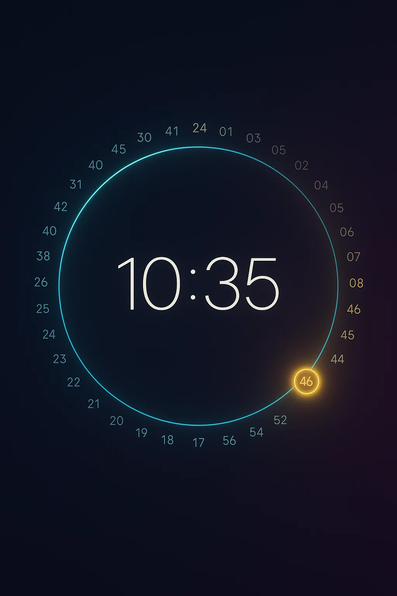

# ⏰ Beautiful Clock App

A stunning, minimalist clock application built with React Native and Expo, featuring smooth animations, multiple themes, and cross-platform support.



## ✨ Features

### 🎨 **Beautiful Design**
- **Circular seconds display** with flowing animations
- **Minimalist digital time** in the center
- **5 gorgeous color themes**: Default, Ocean, Sunset, Forest, Monochrome
- **Dark & Light modes** with automatic background adaptation
- **Optional paper mache texture** for an authentic handmade feel

### 🌊 **Smooth Animations** 
- **Ultra-fluid transitions** between seconds (no ticking!)
- **3-second animation zone** - only current + adjacent seconds animate
- **Slow, contemplative motion** (4-second transitions)
- **Dramatic scaling effects** up to 2.2x size
- **Cubic easing** for natural, organic movement

### ⚙️ **Customization**
- **12/24 hour format** toggle
- **Animation controls** - enable/disable smooth effects
- **Theme persistence** - your settings are remembered
- **Responsive design** - adapts to any screen size

### 🚀 **Cross-Platform**
- **Web**: Fullscreen mode, keyboard shortcuts (F, S, ESC)
- **iOS**: Safe area support, optimized touch targets
- **Responsive**: Works great on mobile, tablet, and desktop

## 🛠️ Quick Start

### Prerequisites
- Node.js 18+ 
- npm or yarn
- Expo CLI (`npm install -g @expo/cli`)

### Installation

```bash
# Clone the repository
git clone <your-repo-url>
cd clock-app

# Install dependencies
npm install

# Start development server
npm start
```

### Platform-Specific Commands

```bash
# Web development (with hot reload)
npm run web

# iOS Simulator (requires Xcode)
npm run ios

# Android (requires Android Studio)
npm run android
```

## 📱 Usage

### Basic Navigation
- **Main screen**: Beautiful clock with flowing seconds animation
- **Settings button**: Top-right gear icon to access customization
- **Back navigation**: Arrow button or swipe to return to clock

### Web Keyboard Shortcuts
- **`F`**: Toggle fullscreen mode (perfect for screensaver!)
- **`S`**: Open settings
- **`ESC`**: Exit fullscreen mode

### Customization Options

#### **Appearance**
- **Dark Mode**: Toggle between dark and light themes
- **Color Theme**: Choose from 5 beautiful color schemes
- **Paper Background**: Enable authentic handmade paper texture

#### **Time Settings**
- **24-Hour Format**: Switch between 12/24 hour display
- **Time Zone**: Currently uses local time (future: world clock)

#### **Animation**
- **Enable Animations**: Toggle the flowing seconds effect
- **Speed**: Currently optimized for contemplative viewing

## 🏗️ Architecture

### Tech Stack
- **React Native** with TypeScript
- **Expo SDK 53** for cross-platform development
- **React Navigation 7** for screen transitions
- **React Native Reanimated 3** for smooth animations
- **React Native SVG** for graphics and gradients
- **AsyncStorage** for settings persistence

### Project Structure
```
src/
├── components/         # Reusable UI components
├── screens/           # Main application screens  
├── contexts/          # React context providers
├── constants/         # Colors, themes, configurations
├── utils/            # Helper functions and utilities
├── navigation/       # Navigation configuration
└── hooks/           # Custom React hooks
```

### Key Components
- **`CircularSeconds`**: Main animation component with proximity-based scaling
- **`TimeDisplay`**: Central digital clock display
- **`PaperMacheBackground`**: Static handmade paper texture generator
- **`ThemeSelector`**: Visual theme picker with previews

## 🎨 Customization Guide

### Adding New Themes
1. Update `src/constants/colors.ts` with new color definitions
2. Add theme option to `ThemeColors` object
3. Update `src/components/ThemeSelector.tsx` with new theme option

### Modifying Animation Speed
In `src/components/CircularSeconds.tsx`:
```typescript
// Make animations faster/slower
scale.value = withTiming(targetScale, {
  duration: 3000,  // Decrease for faster, increase for slower
  easing: Easing.out(Easing.cubic)
});
```

### Adding New Background Textures
1. Create new component in `src/components/`
2. Add toggle option in `src/contexts/SettingsContext.tsx`
3. Add UI control in `src/screens/SettingsScreen.tsx`

## 🚀 Deployment

### Web Deployment
```bash
# Build for production
npm run build

# Deploy to Vercel, Netlify, or your preferred platform
```

### Mobile App Stores
```bash
# Build for iOS (requires Apple Developer account)
expo build:ios

# Build for Android (requires Google Play Console account)
expo build:android
```

## 🤝 Contributing

We welcome contributions! Here's how to get started:

### Development Setup
1. **Fork the repository**
2. **Clone your fork**: `git clone <your-fork-url>`
3. **Create a feature branch**: `git checkout -b feature/amazing-feature`
4. **Install dependencies**: `npm install`
5. **Start development**: `npm run web`

### Code Style
- **TypeScript** for type safety
- **Functional components** with hooks
- **Consistent naming**: camelCase for variables, PascalCase for components
- **Performance first**: Use `useMemo`, `useCallback` where appropriate

### Testing Your Changes
```bash
# Test on web
npm run web

# Test on iOS (if available)
npm run ios

# Check for TypeScript errors
npx tsc --noEmit

# Verify animations work smoothly
# Pay special attention to the flowing seconds effect
```

### Submitting Changes
1. **Test thoroughly** on both web and mobile
2. **Update documentation** if you add features
3. **Create a pull request** with clear description
4. **Include screenshots/videos** for visual changes

### Areas for Contribution
- 🌍 **World Clock**: Multiple time zone support
- ⏰ **Alarms**: Notification-based alarm system
- 🎵 **Sound Effects**: Audio feedback for transitions
- 🎨 **New Themes**: Additional color schemes
- 🏃‍♂️ **Performance**: Animation optimizations
- 📱 **Widgets**: iOS home screen widgets
- 🧪 **Testing**: Unit and integration tests

## 📄 License

MIT License - feel free to use this project for personal or commercial purposes.

## 🙏 Acknowledgments

- **Design inspiration**: Minimalist clock designs
- **Animation concepts**: Fluid motion principles
- **Community feedback**: User experience improvements

---

**Made with ❤️ using React Native and Expo**

*For detailed development notes, see [CLAUDE.md](CLAUDE.md)*